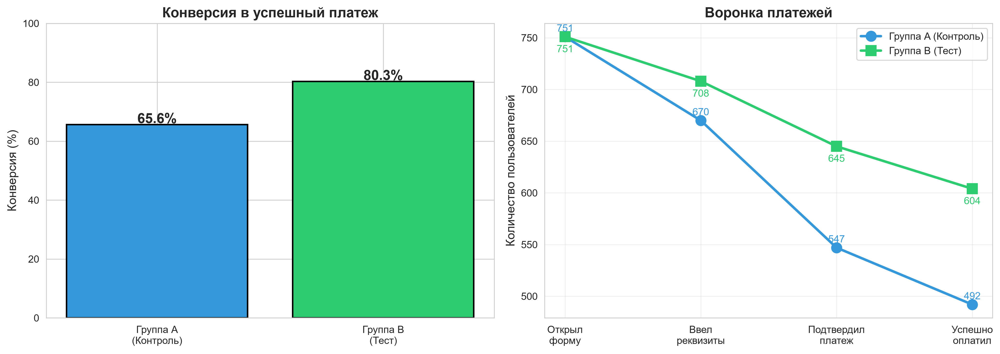
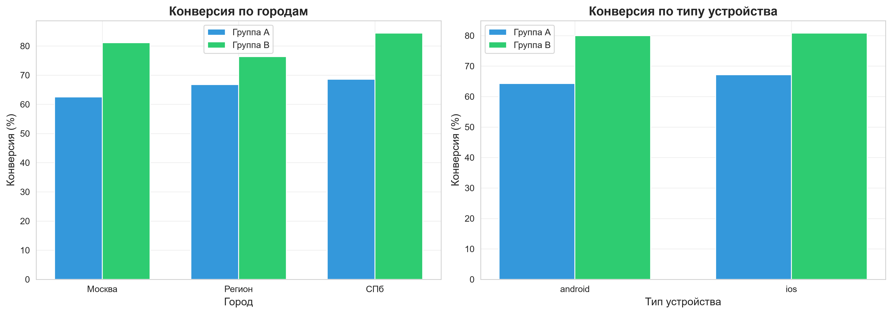

# A/B-тест формы оплаты ЖКХ

Т-Старт, тестовое задание на продуктового аналитика.
Проверялась гипотеза о том, что новая форма оплаты с автозаполнением
реквизитов увеличит долю успешных платежей.

## Задача

Команда продукта разработала новую форму оплаты ЖКХ с упрощённым
заполнением реквизитов. Требовалось оценить, влияет ли изменение
интерфейса на конверсию в успешный платёж, и на основании результата
дать рекомендацию о раскатке формы на всех пользователей.

## Исходные данные

A/B-тест проводился в течение 30 дней. Участники разделены на две
независимые группы:

- группа A (контроль) - старая форма оплаты, 751 пользователь;
- группа B (тест) - новая форма с автозаполнением, 751 пользователь.

Перед анализом выборка очищена от записей с некорректным возрастом,
пустыми идентификаторами и отсутствующей группой. Итоговый объём -
1502 пользователя и 2659 платежей. Исходные данные представлены двумя
листами Excel-файла: таблица пользователей с полом, возрастом, городом
и типом устройства, и таблица платежей с отметками прохождения каждого
шага воронки.

## Методология

Основная метрика - конверсия в успешный платёж, рассчитанная как доля
пользователей, совершивших хотя бы один платёж. Различия между
группами проверялись Z-тестом для двух пропорций при уровне значимости
0.05. Дополнительно построена воронка платежей по этапам (открытие
формы, ввод реквизитов, подтверждение, успешная оплата) и проведён
сегментный анализ по городам и типам устройств.

## Результаты

Конверсия в группе B составила 80.3% против 65.6% в группе A.
Абсолютный прирост - 14.6 процентных пункта, относительный - 22.3%.
Z-статистика равна 6.39, p-значение меньше 0.001, что позволяет
отклонить нулевую гипотезу и признать разницу статистически значимой.

Основной прирост происходит на этапе подтверждения платежа: 81.6% в
контроле против 91.1% в тесте. Эффект стабилен по всем городам (Москва
+18.6 п.п., Санкт-Петербург +15.9 п.п., регионы +9.5 п.п.) и по обоим
типам устройств (Android +15.7 п.п., iOS +13.7 п.п.).





Рекомендация - запустить новую форму для 100% пользователей с
поэтапным внедрением в течение одной-двух недель и мониторингом
ключевых метрик после каждого этапа.

## Стек

Python, pandas, numpy, scipy.stats, matplotlib, seaborn.

## Запуск

Установите зависимости:

```
pip install -r requirements.txt
```

Откройте ноутбук:

```
jupyter notebook ab_test_analysis.ipynb
```

Ноутбук также можно открыть в Google Colab, загрузив его через
интерфейс платформы.
